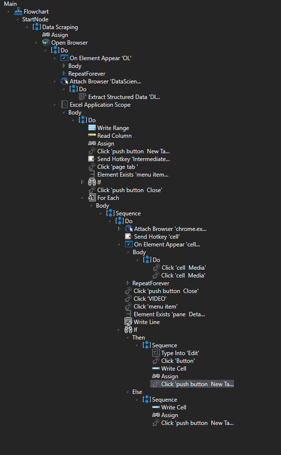

# Uipath
# Google Classroom Video Lectures Data Scraper -
It Can be used for downloading Classroom Lectures in Sorted Order (DateWise)

Features -

1.Title, Download Status and Video link will be stored in Excel Sheet (Latest video will be Shown in the top of the Sheet).

2.To avoid disturbance it mutes the sound while downloading the video.

3.It also closes the browser tab which are not needed for the operation.

